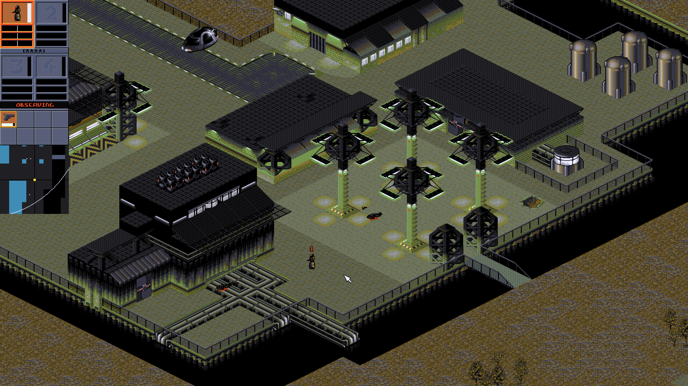

# About this fork of FreeSynd

## Improvements

Make it playable with modern controls and high-resolution screens.

- Fullscreen by default, preserving aspect ratio as in the original DOS game.
- Configurable scaling. Set for example scale_factor = 3 in user.conf. Default is calculated depending on resolution.
- See more of the map in a zoomed out view, pixel-perfect integer scaled.
- Hold down Tab key or Mousewheel to pan the view using the mouse.
- Smooth panning with WASD keys instead of edge-panning.
- High framerate. If you have a 144 Hz monitor scrolling is 144 fps (for example).
- Faster menu transitions.
- Press key 1-4 to select agent. Double press key 1-4 to center on agent.
- Build on macOS with Windows x64 (mingw64) cross-compile.

All credits to the original FreeSynd authors and Bullfrog.

## Developer notes

### Convert data files to lower case
rename.pl -f 'y/A-Z/a-z/' *

### CMake options on macOS
--preset "ninja-clang-arm64-release" -DCONAN_COMMAND=~/Library/Python/3.14/bin/conan

### Go directly to mission with cheats
./FreeSynd -m 8 -c "COOPER TEAM"

### Start with lots of cash and all weapons and mods unlocked
./FreeSynd -m 9 -c "STACKED"

### List of missing implementation
- Enemy agent AI (React to player actions and seek out player agents). IN PROGRESS
- Player agent AI (Reacts acoording to IPA levels, defend themselves). DONE
- Be able to sort gear in the agent equip screen. DONE
- Panic mode. DONE
- Reintroduce edge-panning in addition to WASD.

### Bugs
- If NPC get in the line of fire agent will spray a lot until NPC fall down completely.
- Player agent will try to fire / defend themselves even though there is a wall between them and the enemy. FIXED
- Player agent can't hit enemy agent that is on another level or up the stairs FIXED
- Enemy agent or Police will keep firing in the same place until ammo run out, instead of where you moved. FIXED
